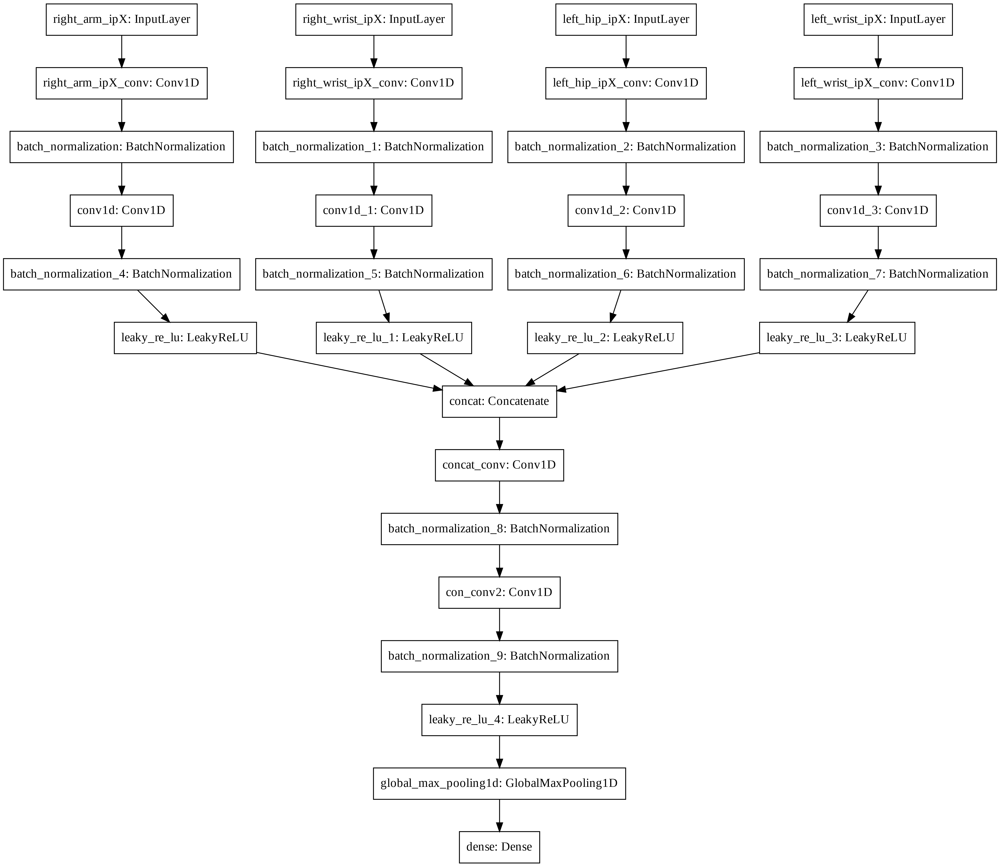

# activity-recognition-abc

### Details

**Submission to the Cooking Activity Recognition Challenge, ABC: competition track [ICIEV&IVPR2020]**

**Task 1:** SCAR-Net 1 (no pre-processing)

**Task 2:** SCAR-Net 2 (no pre-processing)

### Installation

 1. Install Anaconda https://www.anaconda.com/distribution/#download-section
 2. `conda create -n venv python==3.6.8`
 3. `conda activate venv`
 4. `pip install -r requirements.txt`

### Code

 * `cnn_baseline` notebook

### Paper

- [ ] Will be uploaded